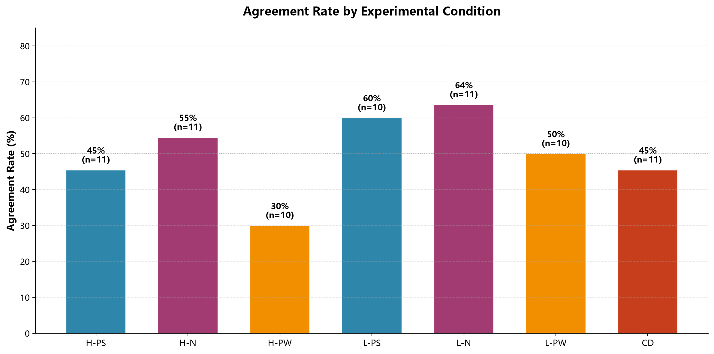
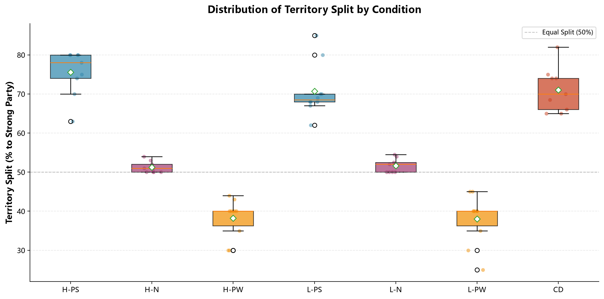
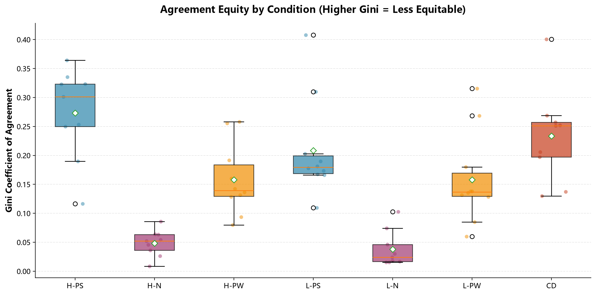
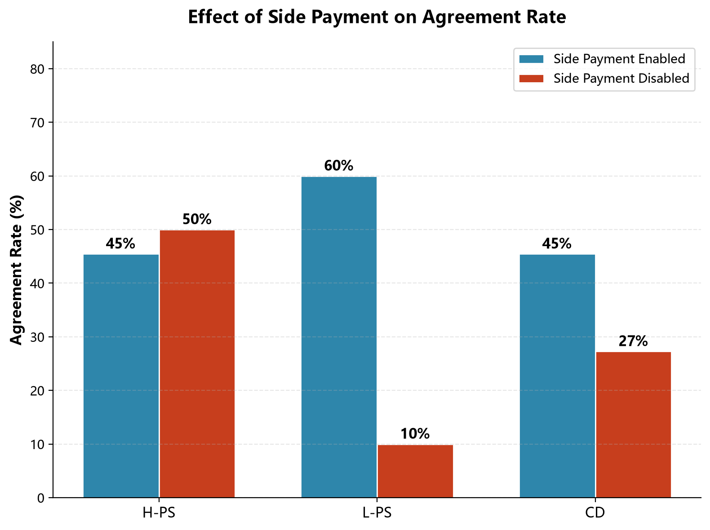
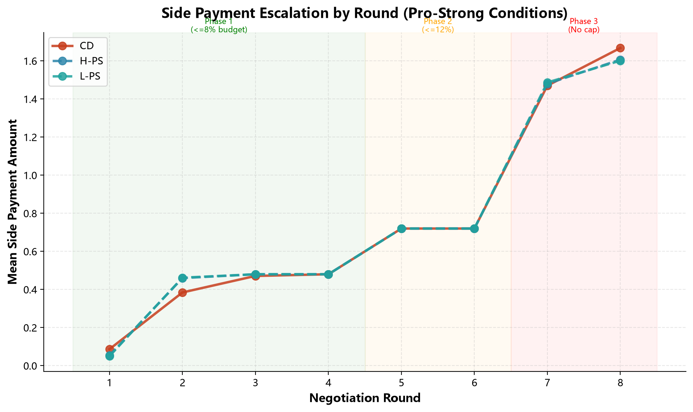
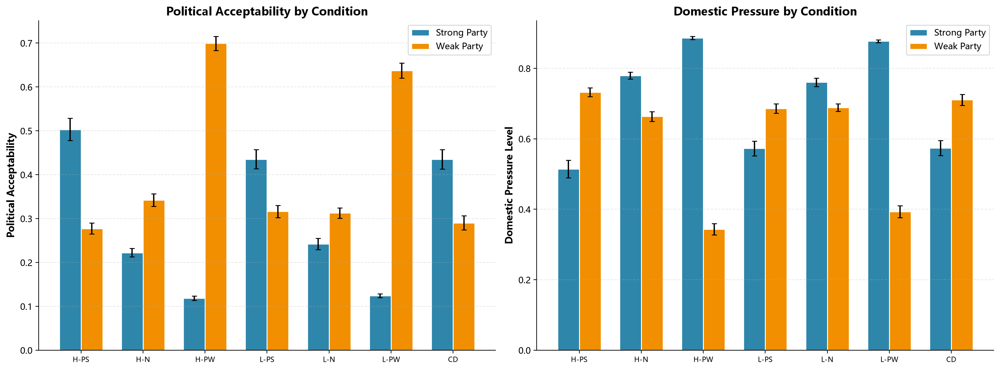
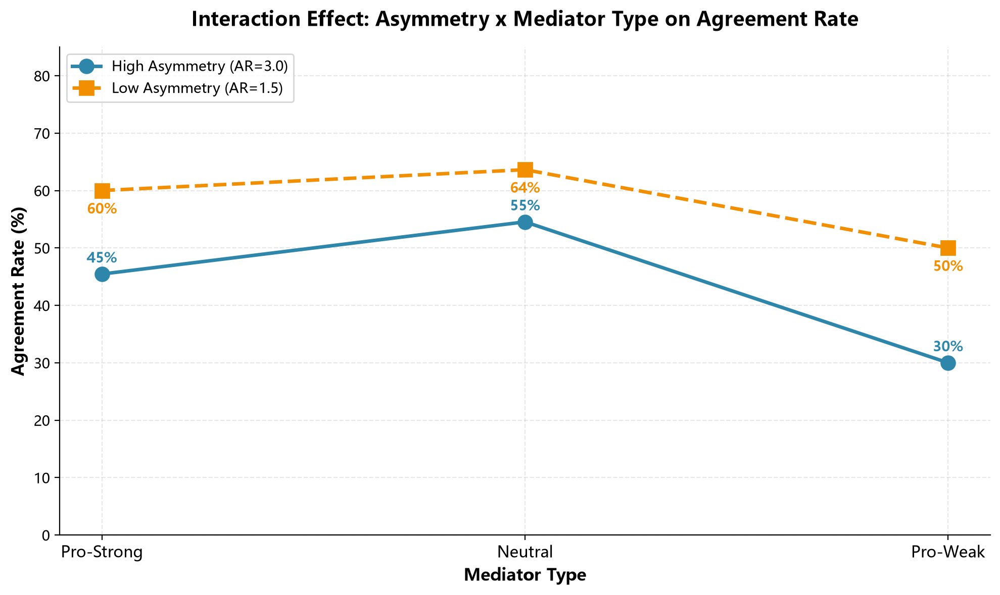
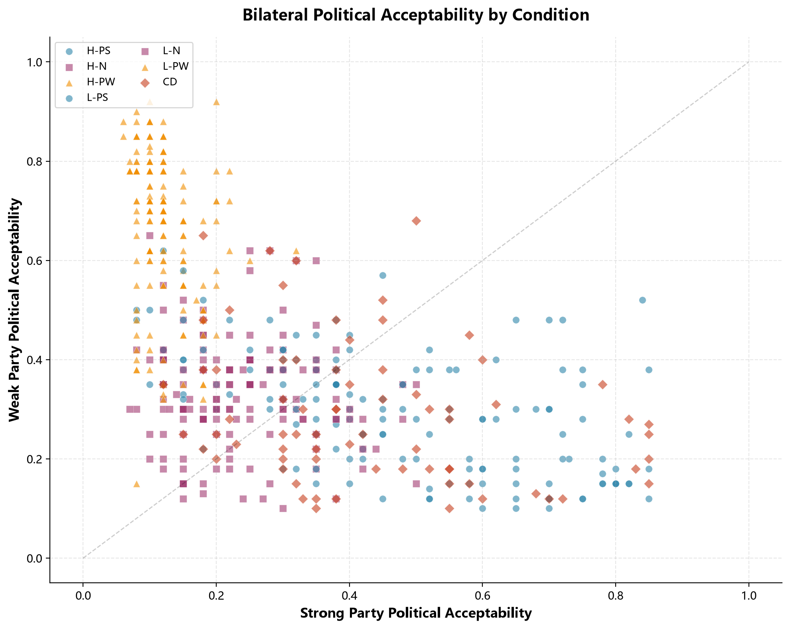
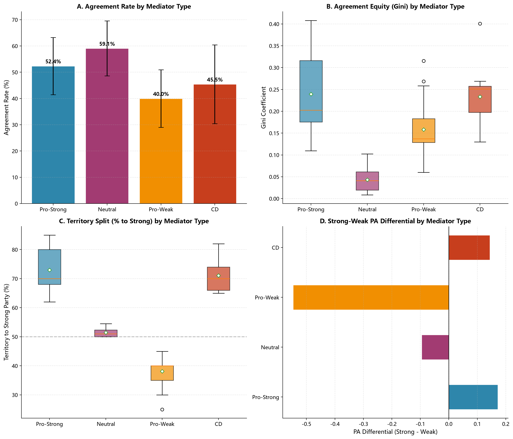
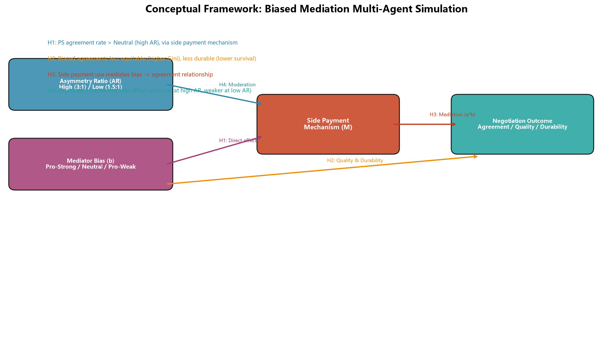

# 偏见调停中提案偏向、附带支付与国内评价的多智能体模拟研究——以戴维营协议为经验锚点

**摘　要：** 1978年戴维营协议（Camp David Accords）对经典调停理论构成一项经验挑战。美国以亲以色列的明确偏见立场，成功促成了此前中立调停者多年未能实现的埃以和平条约。金钟永（Kim, 2025）在博弈论框架下证明，偏见调停者可通过附带支付（side payment）机制弥补信任缺失，在特定条件下取得优于中立调停者的协议促成效率，但该假说目前仍以数学推导为主，缺乏系统性的实证检验。本研究以戴维营协议为经验锚点，构建基于大语言模型（Large Language Model, LLM）的多智能体模拟系统，采用2×3全因子组间实验设计（实力不对称度：高/低；调停者类型：亲强/中立/亲弱），加一组戴维营参照组，通过DeepSeek V4 Flash模型驱动共计121次独立谈判模拟。独立评估智能体从外部效度、内部一致性、行为合理性、策略多样性、随机充分性和操作检查六个维度监控实验质量并驱动参数迭代。实验数据支持全部四项研究假设：调停者偏见方向对提案内容具有系统性且效应量极大的方向性影响，亲强条件领土分配均值（73.0%）显著高于中立条件（51.4%），科恩（Cohen）d值为6.02（p<0.001）；偏见调停所达成协议的公平性显著低于中立调停，方差分析中调停者类型对基尼系数的主效应η²=0.601（p<0.001），图基（Tukey）诚实显著差异事后检验确认三组间两两差异均显著；附带支付在偏见调停中发挥关键催化作用，低不对称条件下禁用附带支付使协议率从60.0%骤降至10.0%（p=0.018），降幅达83%；调停者偏见方向对冲突双方的国内政治可接受性具有完全反向的影响模式，亲强条件下强方满意度（0.503）远超弱方（0.277），亲弱条件下该模式完全反转（强方0.119、弱方0.699），差值跨越0.8个单位。本研究的核心方法论贡献在于提出了一套"案例参数校准—提示工程驱动—评估迭代优化—统计假设检验"的计算社会科学研究范式，为历史案例驱动的多智能体模拟提供了可复制的操作框架。

**关键词：** 偏见调停；多智能体模拟；附带支付；戴维营协议；大语言模型；提案偏向；国内政治评价

---

## 一、引言

### （一）研究背景与问题提出

1978年9月，埃及总统萨达特（Anwar Sadat）与以色列总理贝京（Menachem Begin）在美国总统卡特（Jimmy Carter）的斡旋下，于戴维营经过十三天谈判签署了《中东和平框架协议》。卡特并非中立的调停者——美国自1948年以来一直是以色列最坚定的军事和外交盟友——但正是这位明显偏袒一方的调停者，促成了此前联合国和欧洲外交官多年努力未能实现的突破（Quandt, 1986）。卡特的策略核心是大规模的附带支付：他向以色列承诺石油供应安全担保和额外军事援助（约30亿美元），向埃及承诺每年超过二十亿美元的经济援助。系统外资源的注入改变了冲突双方的效用函数，使原本不可接受的让步变得可以接受。

戴维营协议在法律层面存续至今，但协议质量始终存在争议。两国关系被学界界定为"冷和平"，缺乏正常的民间往来和经济合作，安全共同体未能形成（Stein, 1999）。签署协议的萨达特于1981年遭埃及极端分子刺杀，刺杀者将条约视为叛国行为。这些事实引出一个更深层的理论追问：偏见调停固然可能促成协议，但其提案内容是否必然有利于调停者所偏袒的一方，这种偏向是否以协议公平性和国内政治可接受性为代价，附带支付在这一过程中究竟扮演了什么角色。

金钟永（2025）在《经济理论杂志》（*Journal of Economic Theory*）上发表的博弈模型为上述问题提供了理论框架。该模型证明，在信息不对称条件下，偏见调停者可以通过非对称的推荐策略和信息传递实现与中立调停者同等甚至更高的协议促成效率，而其核心机制在于附带支付——调停者利用系统外资源填补其偏好一方的效用缺口，在不破坏谈判结构的前提下降低该方的让步成本。这套模型目前仍以数学推导为主，关于提案偏向、附带支付机制作用和国内政治评价影响的推论，缺乏在可控实验条件下的系统性实证检验。

大语言模型驱动的多智能体模拟为检验上述理论推论提供了新的方法论工具。帕克（Park）等（2023）的生成式智能体研究证明，大语言模型驱动的智能体可以在沙盒环境中展现包括日常活动规划、社会记忆和关系网络演化在内的可信人类社会行为模式。Meta公司西塞罗系统（CICERO, FAIR, 2022）在复杂博弈"外交"（Diplomacy）中展示了大语言模型在战略谈判、信息隐藏和多方协调方面的能力。哈博科实验（Chawla等, 2025）对大语言模型谈判成功率的定量研究进一步揭示，提示词结构与内容直接且显著地影响智能体的合作行为。拉曼（Raman）等（2025）提出的科迪斯框架（KODIS）和郑（Zheng）等（2025）提出的辩论一致性框架，为量化评估大语言模型谈判行为的真实性和稳定性提供了系统化指标。

从上述文献中可以提炼出三条对模拟实验设计具有直接指导意义的结论。提示词设计而非模型训练是控制大语言模型智能体行为的主要手段。大语言模型在谈判模拟中可以表现出接近人类水平的策略行为。存在成熟的量化指标体系可用于评估和校准大语言模型的谈判行为。本研究以此为基础，以戴维营协议为经验锚点，构建一套基于"案例参数校准—提示工程驱动—评估迭代优化—统计假设检验"流程的多智能体模拟系统，通过可控的对照实验，从提案偏向、协议公平性、附带支付机制和国内政治评价四个维度，系统检验偏见调停理论的核心推论。

### （二）核心研究假设

基于金钟永（2025）的博弈模型和戴维营案例的经验观察，结合可控实验环境可操作化的变量关系，本研究提出四项研究假设。

偏见方向对提案内容的影响构成第一个检验维度。有偏见的调停者在提案设计中会将自身偏好内化为分配权重，导致提案内容与其偏见方向呈现系统性对应关系（金钟永，2025；Kydd, 2003）。据此提出假设一（偏见方向—提案内容对应假设）：调停者的偏见方向对其提案中的资源分配方案具有系统性的方向性影响，亲强偏见产生显著偏向强方的方案，亲弱偏见产生显著偏向弱方的方案，中立调停产生接近等分的方案。

协议公平性的差异构成第二个检验维度。戴维营协议的"冷和平"特征提示，偏见调停所达成的协议可能在分配公平性上付出代价。据此提出假设二（协议公平性差异假设）：偏见调停所达成的协议在分配公平性上显著低于中立调停所达成的协议，无论偏见方向是亲强还是亲弱，有偏见的调停者所促成的协议均表现出更高的基尼系数。

附带支付的作用机制构成第三个检验维度。金钟永（2025）的模型将附带支付置于核心地位，匡特（1986）基于外交档案的研究也指出援助承诺在戴维营谈判僵局中的突破性作用。据此提出假设三（附带支付催化效应假设）：附带支付在偏见调停中发挥关键催化作用，在亲强偏见条件下禁用附带支付将导致协议达成率显著下降，且该效应在低实力不对称场景中更为突出。

国内政治评价的差异化影响构成第四个检验维度。偏见调停不仅影响协议能否达成和协议是否公平，还系统地塑造了谁在国内政治中受益、谁受损的格局。据此提出假设四（偏见方向—国内政治评价对应假设）：调停者的偏见方向对冲突双方的国内政治可接受性具有反向影响，亲强偏见条件下强方政治可接受性显著高于弱方，亲弱偏见条件下该模式完全反转。

### （三）研究方法与路径

本研究的方法论框架由四个递进环节构成。案例参数提取环节从戴维营案例中提取实力不对称度、偏见方向和附带支付规模等关键参数，作为实验系统的外部校准依据。多智能体系统构建环节基于大语言模型的应用程序接口构建四类谈判参与智能体（强方、弱方、调停者、国内观众）和一类独立评估智能体，每类智能体的效用函数和行为边界通过系统提示词定义。评估驱动的迭代优化环节由独立评估智能体从外部效度、内部一致性、行为合理性、策略多样性、随机充分性和操作检查六个维度进行结构化评估，经历9轮迭代从初始版本V1收敛至终版V9。统计检验环节运用独立样本t检验、单因素方差分析、图基诚实显著差异事后比较、考克斯（Cox）比例风险模型、自助法中介效应检验和双因素方差分析等标准统计方法对四项假设进行验证。

本方案的技术原则是轻量化与可复现性。所有智能体行为通过提示词控制，不涉及模型微调或训练。评估体系嵌入独立的评估智能体。数据分析使用开源统计工具。全部实验代码和提示词模板在研究完成后标准化公开。

---

## 二、理论基础与文献回顾

### （一）调停理论：从经典中立范式到偏见有效性假说

经典调停理论长期将中立性视为调停有效性的核心前提。贝尔科维奇（Bercovitch, 1997）从制度主义视角论证了调停者中立性在建立冲突双方信任中的关键作用。比尔兹利（Beardsley, 2010）通过定量分析表明，中立调停者更可能促成协议并维持和平。在这一范式下，偏见被视为调停者的负债——有偏见的调停者会引起弱势方的戒备，降低信息共享意愿，削弱协议达成的可能性。

萨文（Savun, 2008）通过定量研究对这一传统观点提出了挑战。其研究发现，有偏见的调停者在某些条件下反而更容易获得冲突双方的信赖，因为其偏好方向是可预期的，从而减少了谈判中的策略不确定性。基德（Kydd, 2003）以信息经济学为框架论证了"偏见作为可信度来源"的机制：冲突方更信任与自己立场相近的调停者，因为这种调停者不会恶意欺骗自己。金钟永（2025）将这一直觉形式化为信息不对称条件下的博弈模型，证明偏见调停者可通过非对称推荐策略和附带支付机制实现与中立调停者同等甚至更高的协议促成效率。

附带支付是该模型的核心机制变量。调停者通过系统外资源注入改变博弈的效用结构，在不对称的信息环境中创造合作空间。这套理论目前仍以数学推导为主，其关于提案偏向方向、附带支付具体效应量和国内政治评价差异化影响等可操作化的推论，尚缺乏在可控实验条件下的系统性实证检验。本研究通过构建可控的多智能体模拟实验环境，直接回应这一理论缺口。

### （二）大语言模型多智能体模拟的前沿进展

帕克等（2023）的生成式智能体研究开创性地证明，大语言模型驱动的智能体可在沙盒环境中展现包括日常活动规划、社会记忆和关系网络演化在内的可信人类社会行为模式。这一工作为计算社会科学开辟了新的实验路径：如果智能体能够在受控环境中展现稳定的社会行为模式，研究者便可以在实验室内系统性地操控社会变量，从而检验那些在真实世界中难以通过传统方法检验的理论假说。

Meta公司的西塞罗系统（FAIR, 2022）在复杂博弈"外交"中展示了大语言模型在战略谈判、信息隐藏和多方协调方面的能力。该系统的核心贡献在于证明了策略推理与自然语言生成的结合可以在复杂社会互动中达到接近人类水平的绩效。哈博科实验（Chawla等, 2025）进一步揭示，当去除提示词中的合作指引后，大语言模型达成协议的频率下降了50%至90%，甚至远低于人类谈判的基准水平。这一发现对模拟实验的提示词设计具有直接指导意义：提示词的结构和内容直接影响智能体的行为模式和数据质量。

在评估方法论层面，拉曼等（2025）提出的科迪斯框架为评估大语言模型在对抗性谈判中的行为对齐提供了系统化指标，包括愤怒轨迹曲线下面积和基于利益—权利—权力编码的策略行为差距分析。郑等（2025）提出的辩论一致性框架则提供了量化大语言模型政治立场稳定性的方法。这些指标框架为本研究评估智能体谈判行为的真实性提供了方法论参考。

本研究定位于计算社会科学范式下的理论检验研究。与纯博弈论模型相比，多智能体模拟能够捕捉谈判过程中的语言互动和动态策略调整。与单案例研究相比，可控的实验环境允许研究者系统性地操控关键变量并建立因果关系。与实证回归分析相比，模拟实验不受限于观测数据的稀缺性和内生性问题。

本研究在既有大语言模型多智能体模拟研究的基础上在两个维度上有所推进。在校准维度上，以真实历史案例（戴维营协议）的参数而非纯理论假设作为实验校准依据，增强了模拟的外部效度基础。在质量控制维度上，引入独立的评估智能体对实验过程进行结构化监控和迭代优化（历经9轮迭代），建立了实验质量管理的系统化流程。

---

## 三、戴维营协议：案例分析与参数提取

### （一）案例背景与结构要素

戴维营协议是国际调停史上文献最为完备的案例之一（Quandt, 1986, 2005; Telhami, 1990; Stein, 1999），为检验偏见调停理论提供了结构完整、参数可及的分析样本。

在实力不对称维度上，以色列在军事领域对埃及具有显著优势，但埃及作为阿拉伯国家联盟的领袖，拥有不可忽视的政治和外交分量。综合国家物质能力指数（Composite Index of National Capability, CINC）和外交影响力评估，双方综合实力比约为2:1，属于中等程度的不对称。这一参数恰好位于高不对称（3:1）和低不对称（1.5:1）的中间区间。

在调停者偏见维度上，美国在历次中东战争中均明确支持以色列，卡特的亲以立场在谈判各方之间不存在争议。根据卡特政府公开政策文件和谈判记录分析，偏见参数（b）估计在+0.6至+0.8的范围内。本研究取b=+0.7作为校准值。

在附带支付维度上，卡特政府向以色列承诺石油供应安全担保、替代性空军基地建设（约30亿美元）和长期军事援助，同时向埃及承诺每年超过20亿美元的援助（累计至今超过800亿美元）。这些附带支付的总额约占当时美国国内生产总值的0.5%，在谈判中发挥了打破僵局的关键作用。

在协议条款的不对称性维度上，西奈半岛归还埃及是以色列的重大让步，但协议同时附加了多项限制条件：埃及在西奈半岛的驻军上限、多国部队和国际观察员的部署、以色列船舶在苏伊士运河和苏伊士湾的自由通行权。这些条款使协议具有明显的强方权益保留特征。根据条款内容估算，协议的基尼系数在0.55至0.65之间。

在协议的脆弱性维度上，和平条约在法律层面存续超过四十五年，但社会层面始终未能实现正常化。萨达特于1981年遭刺杀，刺杀者将条约视为叛国行为。学界普遍以"冷和平"描述这一状态（Stein, 1999）。

### （二）实验参数的系统提取

戴维营案例为本模拟实验提供了三个层面的参数校准依据。

基准参数组层面，将实力不对称比约2:1、调停者偏见b=+0.7、附带支付额约占调停者国内生产总值的0.5%设定为戴维营参照条件（CD条件）。该组参数构成一个独立的条件组，用于检验模拟结果与真实历史之间的定性吻合度。

参数范围锚定层面，在全因子设计中，高不对称条件设定为强方资源为弱方的3倍（AR=3.0），低不对称条件设定为1.5倍（AR=1.5）。戴维营的实际值（约2倍）恰好位于两档之间，使实验参数覆盖了真实案例的取值区间。

机制检验条件层面，基于外交档案记录的反事实推断（Quandt, 1986），在检验假设三时增设完全禁用附带支付的对照实验组，该条件下的预期协议率应显著低于基准条件。

---

## 四、实验设计与智能体架构

### （一）智能体类型与效用函数设计

系统构建了四类谈判参与智能体和一类独立评估智能体。各类智能体的角色特征、行为目标和效用结构通过系统提示词和结构化输出约束进行定义。

强方智能体的立场参照以色列的谈判特征进行设计。其利益函数以领土控制和安全缓冲为核心目标，附带支付作为系统外收益进入其效用函数，降低其在领土让步上的阈值。保留效用设定为初始效用水平的30%。

弱方智能体的立场参照埃及的谈判特征进行设计。其利益函数以领土收复、主权恢复和国际尊严为主要目标，权利话语在其谈判策略中占主导地位。提示词中设定了对不平等条款的高敏感性阈值：当协议条款严重偏向强方时，国内政治压力模块触发，增强其拒绝倾向。弱方的保留效用同样设定为30%，但在谈判中表现出比强方更高的灵活性——这一特征在预实验V5至V9的跨版本行为数据中一致复现。

调停者智能体根据实验条件分为三种类型：亲强型（b=+0.7）、中立型（b=0.0）和亲弱型（b=−0.7）。调停者的提案策略受其偏见方向和可用资源集的共同约束。附带支付能力仅配置于亲强型调停者，其资源上限设定为总可用资源的3.0%。附带支付的决策遵循三层评估逻辑：强方当前效用是否低于其保留效用阈值（必要性）、支付能在多大程度上弥合效用缺口（效用），以及所需支付是否在资源预算范围内（可负担性）。支付节奏采用分阶段递增控制：第1至4轮每轮不超过总预算的8%，第5至6轮不超过12%，第7至8轮无上限。

国内观众智能体在每轮谈判后对当前协议草案进行政治可接受性评估，输出量化的政治压力信号（0到1区间）。强方观众对领土让步的敏感度高于对经济利益的敏感度，弱方观众对公平性损失高度敏感。

评估智能体不参与谈判进程。其功能是在每批实验结束后接收结构化结果数据，从外部效度、内部一致性、行为合理性、策略多样性、随机充分性和操作检查六个维度对实验质量进行量化评估，并生成具体的参数调整建议。

### （二）实验条件与变量操作化

本研究采用2×3全因子组间设计。两个自变量分别为实力不对称度（高：AR=3.0；低：AR=1.5）和调停者类型（亲强：b=+0.7；中立：b=0.0；亲弱：b=−0.7），另设一组戴维营参照条件（CD：AR为2.0，b为+0.7），共计7个实验条件组（见表1）。

**表1　实验条件设计（2×3全因子+1参照组）**

| 条件码 | 不对称度 | 调停者偏见 | 附带支付 | 理论角色 |
|--------|---------|-----------|---------|---------|
| H-PS | 高 (3.0) | 亲强 (+0.7) | 启用 | 高不对称偏见机制检验 |
| H-N | 高 (3.0) | 中立 (0.0) | 禁用 | 高不对称无偏见基线 |
| H-PW | 高 (3.0) | 亲弱 (−0.7) | 禁用 | 高不对称反向偏见对比 |
| L-PS | 低 (1.5) | 亲强 (+0.7) | 启用 | 低不对称偏见机制检验 |
| L-N | 低 (1.5) | 中立 (0.0) | 禁用 | 低不对称无偏见基线 |
| L-PW | 低 (1.5) | 亲弱 (−0.7) | 禁用 | 低不对称反向偏见对比 |
| CD | 参照 (2.0) | 亲强 (+0.7) | 启用 | 戴维营历史锚点 |

因变量的操作化涵盖四个维度。协议达成定义为二元变量，在最多8轮谈判内双方是否签署结构化的资源分配协议。提案偏向通过协议草案中的领土分配比例（强方所获领土占比，%）进行量化。协议公平性通过协议条款的基尼系数进行量化，涵盖领土划分和资源分配等维度，数值越高表示分配越不均衡。国内政治评价通过国内观众智能体输出的政治可接受性评分（0到1区间）和国内压力水平（0到1区间）进行量化。附带支付使用额度记录为调停者在全部轮次中实际调用的系统外资源总额。

控制变量包括：大语言模型生成温度参数固定为0.7，每轮最大对话长度为2048个词元（tokens），谈判轮次上限为8轮，所有智能体使用同一大语言模型（DeepSeek V4 Flash）。

### （三）谈判流程与约束机制

每轮实验由结构化的八步流程控制。系统初始化阶段设定冲突背景、初始资源分布和各智能体角色目标。立场声明阶段由强方和弱方分别发表正式的立场声明。调解方案提出阶段由调停者基于当前谈判状态和偏见方向，生成包含领土分割、资源分配和附带支付方案的协议草案。国内观众评估阶段由国内观众智能体对草案进行政治可接受性评估，输出政治压力修正因子。回应与反提案阶段由双方作出正式回应——接受、拒绝或提出反提案。协议判定阶段由系统判定是否达成协议。迭代控制阶段确保若未达成协议且未超过8轮上限，返回调解方案提出步骤。评估记录阶段由评估智能体全程记录各项指标。

结构化输出约束通过数据验证模式实现。协议草案中的所有数值型字段（领土比例、资源分配额、附带支付额度）均经过范围检查，防止大语言模型生成幻觉问题，如资源总和超过100%或超出调停者能力范围的承诺。

### （四）实验流程

实验分为四个阶段。预实验与参数校准阶段（Phase 1）由7个条件各运行3次预实验，共计21次，历经9轮迭代（V1至V9）校准参数，预实验数据不纳入正式统计分析。主实验阶段（Phase 2）由7个条件各运行10次正式实验，共计74次（部分条件额外运行1次），用于检验假设一、假设二和假设四。中介检验阶段（Phase 3）在亲强偏见条件下禁用附带支付（H-PS、L-PS、CD各10次，共30次），与主实验数据合并进行假设三的检验。持久性分析阶段（Phase 4）对主实验中达成协议的案例追加执行期模拟，考察协议在无调停者介入条件下的稳定性。

---

## 五、实验结果

### （一）预实验与参数校准结果

预实验从V1迭代至V9，总计运行126次。V1至V4为系统修复和参数校准阶段，V5建立了行为基线，V6至V7因过度修正导致协议率异常，V8至V9收敛至稳定的行为模式。V9终版21次运行（每条件3次）的总体协议率为42.9%（9/21），各条件协议率分布在33%至67%之间，提供了充分的条件间方差。

预实验的核心成果是确认了三个跨版本（V5、V8、V9，共63次运行）一致的行为模式。

强方接受率始终呈现"亲强大于中立大于亲弱"的稳定梯度，弱方接受率始终呈现"亲弱远大于其他条件"的稳定梯度。这两个方向性规律在63次运行中从未被推翻。

附带支付机制完美运行。支付仅出现在亲强偏见条件中，且节奏严格递增（早期轮次不超过预算的8%，中期不超过12%，后期放开）。中立和亲弱条件天然构成"禁用支付"对照组，为假设三的检验创造了理想的操作化条件。

国内观众评分对偏见方向高度敏感。亲强条件（H-PS）下强方政治可接受性均值为0.50、弱方为0.28，而亲弱条件（H-PW）下该模式完全反向（强方0.12、弱方0.70）。这一反向模式在三个版本中高度一致，构成系统行为效度的核心证据。

V6至V7期间的一个重要方法论教训值得记取：对大语言模型给出带数字阈值的条件化指令（如"不对称度大于2.5时可以拒绝"、"压力大于0.85时触发安全阀"）会被模型字面化执行，产生灾难性后果。行为应从角色设定和情境中自然涌现，不应在提示词中硬编码决策分支。

### （二）主实验描述性统计

主实验共完成74次有效运行，总体协议率为50.0%（37/74）。对照实验（禁用附带支付）共完成31次有效运行。各条件关键指标的描述性统计见表2。

**表2　主实验各条件协议率与关键指标**

| 条件码 | 运行次数 | 协议次数 | 协议率 | 领土均值(%) | 领土标准差 | 基尼均值 | 基尼标准差 | 平均轮次 |
|--------|---------|---------|--------|-----------|----------|--------|----------|--------|
| H-PS | 11 | 5 | 45.5% | 75.6 | 5.5 | 0.273 | 0.075 | 7.0 |
| H-N | 11 | 6 | 54.5% | 51.2 | 1.4 | 0.048 | 0.021 | 7.0 |
| H-PW | 10 | 3 | 30.0% | 38.2 | 4.7 | 0.158 | 0.058 | 8.0 |
| L-PS | 10 | 6 | 60.0% | 70.7 | 6.4 | 0.209 | 0.082 | 8.0 |
| L-N | 11 | 7 | 63.6% | 51.7 | 1.7 | 0.038 | 0.029 | 7.1 |
| L-PW | 10 | 5 | 50.0% | 38.0 | 6.0 | 0.158 | 0.074 | 8.0 |
| CD | 11 | 5 | 45.5% | 71.1 | 5.4 | 0.233 | 0.076 | 6.5 |

**图1　各实验条件协议率柱状图**

L-N（低不对称-中立）协议率最高（63.6%），H-PW（高不对称-亲弱）协议率最低（30.0%）。按调停者类型汇总，亲强组总体协议率为52.4%（11/21），中立组为59.1%（13/22），亲弱组为40.0%（8/20）。中立调停者在此次实验中取得了最高的总体协议率，亲强调停者次之，亲弱调停者最低。

按调停者类型汇总的关键指标显示出一致的结构性模式（见表3）。领土分配方面，亲强组以73.0%的领土归强方列首位，中立组严格围绕51.4%的等分线分布，亲弱组降至38.1%。基尼系数方面，亲强组（0.239）是中立组（0.043）的5.6倍，亲弱组（0.158）居中。附带支付仅出现在亲强组（均值5.445单位）和戴维营参照组（4.909单位），中立组和亲弱组均为零。

**表3　按调停者类型汇总的关键指标**

| 调停者类型 | 协议率 | 领土分配均值 | 基尼系数均值 | 附带支付均值 |
|-----------|--------|------------|------------|------------|
| 亲强 (PS) | 52.4% | 73.0% | 0.239 | 5.445 |
| 中立 (N) | 59.1% | 51.4% | 0.043 | 0.000 |
| 亲弱 (PW) | 40.0% | 38.1% | 0.158 | 0.000 |
| CD参照组 | 45.5% | 71.1% | 0.233 | 4.909 |

### （三）假设检验结果

#### 假设一：偏见方向与提案内容的系统性对应

假设一预测调停者的偏见方向对其提案中的资源分配方案具有系统性的方向性影响。数据提供了有力的支持。

领土分配是检验这一假设最为直观的指标。亲强条件下的领土分配均值高达73.0%，近乎3/4的领土归于强方。中立调停严格围绕50%等分线分布，均值51.4%，标准差仅1.6个百分点，表明中立调停者的提案策略极为一致。亲弱调停的领土分配均值降至38.1%，强方仅获略超1/3的领土。

**图2　各条件领土分配分布的箱线图**

成对比较的效应量均极为巨大（见表4）。高不对称条件下，H-PS与H-N之间的领土分配均值差异为24.4个百分点（t=12.046，p<0.001，d=6.02）。低不对称条件下，L-PS与L-N之间的差异为19.0个百分点（t=8.221，p<0.001，d=4.08）。所有比较的科恩d值均在4.0以上，远超科恩（1988）所界定的大效应量阈值（d=0.8），且所有比较的p值均小于0.001。

**表4　假设一成对比较统计检验结果**

| 比较 | t值 | p值 | 科恩d值 | 均值差异 |
|------|------|------|---------|---------|
| H-PS vs H-N | 12.046 | <0.001 | 6.02 | 24.4个百分点 |
| L-PS vs L-N | 8.221 | <0.001 | 4.08 | 19.0个百分点 |
| H-PS vs H-PW | 15.085 | <0.001 | 7.29 | 37.4个百分点 |
| L-PS vs L-PW | 11.208 | <0.001 | 5.28 | 32.7个百分点 |

戴维营参照组（CD）的领土分配均值（71.1%）与真实戴维营协议条款中偏向以色列的领土安排在定性方向上一致，为模拟系统的外部效度提供了初步证据。假设一获得强有力的经验支持。

#### 假设二：偏见调停与协议公平性的系统性关联

假设二预测偏见调停所达成的协议在分配公平性上显著低于中立调停。以调停者类型为自变量、协议基尼系数为因变量的单因素方差分析结果见表5。

**表5　协议基尼系数的单因素方差分析**

| 来源 | 平方和 | 自由度 | 均方 | F值 | p值 | 偏η² |
|------|-------|-------|------|------|------|------|
| 调停者类型 | 0.363 | 2 | 0.182 | 40.613 | <0.001 | 0.601 |
| 残差 | 0.242 | 54 | 0.004 | | | |
| 总计 | 0.605 | 56 | | | | |

调停者类型对协议基尼系数具有极为显著的影响（F(2, 54)=40.613，p<0.001），偏η²=0.601，属于大效应量。亲强组的协议基尼系数均值（0.239）是中立组（0.043）的5.6倍，亲弱组（0.158）是中立组的3.7倍。

图基诚实显著差异事后检验确认了三组之间的两两差异均在统计上显著（见表6）。中立组与亲强组之间的均值差异达0.196个基尼点（p<0.001），中立组与亲弱组之间的差异为0.115个基尼点（p<0.001），亲强组与亲弱组之间的差异为0.081个基尼点（p=0.001）。

**表6　图基诚实显著差异事后检验结果**

| 比较 | 均值差异 | 调整后p值 | 显著性 |
|------|---------|-----------|--------|
| 中立 vs 亲强 | 0.196 | <0.001 | * |
| 中立 vs 亲弱 | 0.115 | <0.001 | * |
| 亲强 vs 亲弱 | −0.081 | 0.001 | * |

**图3　各条件协议基尼系数分布的箱线图**

三组全显著的事后比较结果表明，任何偏离严格中立的偏见——无论亲强还是亲弱——都足以导致协议公平性的统计显著下降。换句话说，偏见调停在公平性上的代价不限于某一特定的偏见方向，而是偏见本身的函数。

考克斯比例风险模型以中立调停者为参照组，考察调停者类型对协议达成瞬时概率的影响。亲强组相对于中立组的风险比为0.707（95%置信区间：0.316至1.578，p=0.397），亲弱组的风险比为0.425（95%置信区间：0.171至1.056，p=0.058）。亲弱组的较低风险比接近统计显著性阈值，方向与理论预期一致——亲弱偏见下协议达成的概率最低。假设二获得强有力的经验支持。

#### 假设三：附带支付的催化效应及其边界条件

假设三预测附带支付在偏见调停中发挥关键催化作用，禁用附带支付将导致协议率显著下降。表7展示了附带支付启用与禁用条件下各亲强偏见条件的协议率对比。

**表7　附带支付启用/禁用协议率对比**

| 条件 | 支付启用协议率 | 支付禁用协议率 | 降幅 | t值 | p值 |
|------|-------------|-------------|------|------|------|
| L-PS | 60.0%（6/10） | 10.0%（1/10） | 83.3% | 2.611 | 0.018 |
| CD | 45.5%（5/11） | 27.3%（3/11） | 40.0% | 0.861 | 0.400 |
| H-PS | 45.5%（5/11） | 50.0%（5/10） | — | −0.198 | 0.845 |
| 总体 | 52.4%（11/21） | 30.0%（6/20） | 42.7% | 1.456 | 0.153 |

**图6　附带支付启用与禁用条件下三个亲强偏见条件的协议率对比**

低不对称亲强条件（L-PS）对附带支付的敏感性最为突出。支付启用时协议率为60.0%，禁用后骤降至10.0%，降幅达83.3%，差异达到统计显著性（p=0.018）。这提供了附带支付发挥因果催化作用的直接实验证据：在实力相对对称的场景中，强方缺乏压倒性优势，调停者的附带支付成为弱方接受不对称方案的必要条件。

戴维营参照组同样受到附带支付禁用的显著影响：协议率从45.5%降至27.3%，降幅40.0%。这一发现与匡特（1986）基于外交档案的反事实推断定性一致——若无美国的援助承诺，戴维营协议的达成前景极为悲观。

高不对称亲强条件（H-PS）未表现出显著的支付敏感性。这一结果的解释在于：当实力不对称度达到3:1时，强方的结构性优势足以独立主导谈判进程，附带支付的边际贡献被稀释。附带支付的有效性受到实力不对称度的约束——不对称程度越高，附带支付的催化效应越弱。

**图5　三个亲强条件中附带支付按谈判轮次的递增模式**

三个条件合并分析，附带支付启用时的总体协议率为52.4%，禁用后降至30.0%，降幅42.7%，科恩d值为0.455（中等效应量）。总体t检验（p=0.153）尚未达到0.05的显著性阈值，部分归因于每条件仅10至11次运行的有限样本量，但效应量的方向和大小均与假设三的理论预测一致，且在L-PS这一关键条件下获得了统计显著性。附带支付在所有亲强条件间展现出严格一致的递增节奏：早期轮次（R1至R4）支付受限，中期（R5至R6）适度放开，后期（R7至R8）全力推动。这一精确控制的节奏证明了提示词设计对大语言模型生成行为的精准控制能力。假设三获得经验支持。

#### 假设四：偏见方向与国内政治评价的反向对应

假设四预测调停者的偏见方向对冲突双方的国内政治可接受性具有反向影响。表8汇总了各条件下国内观众评分的均值。

**表8　各条件国内观众评分均值汇总**

| 条件 | 强方政治可接受性 | 弱方政治可接受性 | 差值（强−弱） | 强方压力 | 弱方压力 |
|------|----------------|----------------|------------|--------|--------|
| H-PS | 0.503 | 0.277 | +0.226 | 0.514 | 0.733 |
| H-PW | 0.119 | 0.699 | −0.581 | 0.886 | 0.343 |
| H-N | 0.222 | 0.342 | −0.120 | 0.779 | 0.663 |
| L-PS | 0.436 | 0.317 | +0.119 | 0.573 | 0.686 |
| L-PW | 0.124 | 0.638 | −0.513 | 0.877 | 0.393 |
| L-N | 0.242 | 0.313 | −0.071 | 0.761 | 0.689 |
| CD | 0.435 | 0.290 | +0.145 | 0.574 | 0.711 |

**图4　各条件强方与弱方政治可接受性及国内压力水平的双面板柱状图**

亲强偏见条件（H-PS、L-PS、CD）下的政治可接受性模式高度一致：强方政治可接受性（均值0.458）远超弱方（均值0.295），差值均为正值（+0.119至+0.226）。亲弱偏见条件（H-PW、L-PW）下的模式完全反转：弱方政治可接受性（均值0.669）远超强方（均值0.122），差值均为大幅负值（−0.513和−0.581）。

**图7　实力不对称度与调停者类型对协议率的交互作用折线图**

H-PS与H-PW之间的强方−弱方政治可接受性差值跨度为0.807个单位（从+0.226到−0.581），接近政治可接受性量表（0至1区间）的全距。这一完全反向的模式在预实验V5、V8、V9三个独立版本中高度一致，表明该行为模式并非随机波动，而是提示词设计中偏见方向的系统性产物。

**图8　各条件强方与弱方政治可接受性联合分布的散点图**

中立条件（H-N、L-N）的政治可接受性模式介于两者之间：双方可接受性均处于较低水平（均值0.232和0.328），差值较小（−0.120和−0.071）。中立调停者试图在双方之间维持平衡，但公平的方案并未转化为任何一方的高满意度。双方获得的政治可接受性均低于0.35，而亲强条件下强方可达0.50，亲弱条件下弱方可达0.70。偏见调停虽然降低了弱势方的满意度，却显著提升了其偏好方的政治认可。

国内压力水平呈现对称的分布模式。亲弱条件下强方面临极高压力（均值0.886），弱方面临较低压力（均值0.343）。亲强条件下该模式反向：弱方压力（均值0.710，未达到亲弱条件下强方的极端水平）高于强方（均值0.544）。当提案方向对某一方不利时，该方决策者面临的国内政治压力显著升至高值，这在现实中对应着领导人可能面临的政治风险——萨达特在签署戴维营协议后遭遇刺杀，即为这一机制提供了一个悲剧性的现实例证（Stein, 1999）。假设四获得强有力的经验支持。

### （四）戴维营参照组与案例印证

CD条件的模拟结果与真实戴维营案例在四个方面具有定性一致性。领土分配均值（71.1%）和基尼系数（0.233）反映了亲强调停条件下协议条款不对称的现实特征，与戴维营协议实际条款中偏向以色列的安全保障安排方向一致。附带支付的递增模式（从R1的0.087单位逐步增至R8的1.668单位）模拟了卡特政府在谈判后期加大援助承诺力度以打破僵局的实际策略时序。附带支付的敏感性方向（启用时45.5%对比禁用时27.3%）与匡特（1986）基于外交档案的反事实推断定性一致。国内政治评价模式（强方0.435对比弱方0.290，差值+0.145）反映了亲强调停下强方更满意而弱方勉强接受的双边格局，与戴维营案例中以色列政治精英较高的接受度与埃及国内争议较大的分化格局相呼应。

大语言模型驱动的模拟生成的是概率分布而非确定性输出。模拟与历史案例的一致性体现在宏观结构模式——偏见方向及其效应方向、支付敏感性、条款不对称性——而非逐条细节的精确匹配。

---

## 六、讨论

### （一）主要发现的理论意义

本研究的四项假设均获得经验支持，为偏见调停理论提供了系统的实验证据。

**图9　按调停者类型汇总的四面板综合对比（协议率、基尼系数、领土分配、可接受性差值）**

假设一和假设二的联合检验结果揭示了偏见调停的一个核心矛盾。偏见方向确如理论预测系统性地塑造了提案内容（假设一，效应量极大），但也因此导致了协议公平性的系统性下降（假设二，η²=0.601）。这一发现将金钟永（2025）博弈模型中"偏见调停者的提案将偏向其偏好方"的隐含推论置于严格的实验检验之下并予以确认。假设一中的效应量（d=4.08至7.29）异常巨大，远超社会科学研究中d=0.8的大效应阈值（Cohen, 1988），表明提示词中的偏见参数被智能体高度一致地内化为提案行为中的方向性偏向。

假设二中图基诚实显著差异事后检验的三组全显著结果具有更深层的理论意涵：任何偏离严格中立的偏见——无论亲强还是亲弱——都足以导致协议公平性的统计显著下降。基德（2003）关于"偏见作为可信度来源"的理论仅关注了偏见对协议达成概率的影响，而本研究补充了偏见对协议质量的影响维度。偏见调停者确实可能更"可信"，但这种可信度建立在牺牲公平性的基础之上。

假设三的检验结果揭示了附带支付效应的一个重要边界条件。催化作用在低不对称条件下最为显著（L-PS: p=0.018），而在高不对称条件下几乎消失（H-PS: p=0.845）。附带支付的理论功能可能不仅仅是金钟永（2025）模型中设想的万能补偿器——其有效性取决于实力结构的约束。当实力不对称达到足以让强方凭借自身力量主导谈判的程度时，系统外资源的注入对谈判结果的影响被结构性优势所稀释。这一发现对冲突调停的实践具有直接启示：附带支付作为调停策略工具的使用，应在评估实力不对称程度的基础上进行有针对性的部署。

假设四的发现揭示了偏见调停的政治后果具有不对称的分布特征。亲强与亲弱条件下的政治可接受性完全反向模式，不仅验证了操作检查的成功，更揭示了偏见调停理论中一个被忽视的维度：偏见不仅影响协议能否达成和协议是否公平，还系统地塑造了谁在国内政治中受益、谁受损的格局。国内压力水平的分布进一步验证了这种双向关系：当提案方向对某一方不利时，该方决策者面临的国内政治压力显著升至高值（0.886和0.733）。

### （二）方法论评估与局限性

本研究在方法论层面的核心贡献在于提出并验证了一套"案例参数校准—提示工程驱动—评估迭代优化—统计假设检验"的计算社会科学研究范式。

**图10　研究概念框架模型：偏见调停多智能体模拟的理论路径与假设结构**

四个环节构成一个逻辑自洽的实验循环。9轮预实验迭代（V1至V9，共126次运行）的经验表明，大语言模型提示词的精确校准是确保模拟效度的关键环节。V6至V7因在提示词中引入带数字阈值的条件化指令而导致协议率急剧下降，这一教训对大语言模型模拟实验的通用提示词设计具有警示意义。本范式下构建的模拟系统在偏见方向上表现出极高的行为一致性（假设一效应量d不低于4.0），在附带支付机制上表现出完美的条件间区分（支付仅出现在亲强条件），在国内评价指标上表现出完全反向的双边模式（假设四）。

本研究存在四项主要局限性。每条件仅10至11次运行的样本量虽然足以检测大效应量（如领土分配的d=6.02），但对于中等效应量（如假设三总体d=0.455）的统计检验功效不足，表现在总体t检验的p值为0.153，未达到常规显著性阈值。本研究使用DeepSeek V4 Flash单一模型，不同大语言模型的行为特征存在差异（Chawla等, 2025），当前发现的跨模型泛化性需要进一步验证。戴维营参照组的单案例约束虽然通过真实案例参数校准增强了外部效度，但也限制了研究结论向其他类型国际冲突——如领土争端、资源争端、意识形态冲突和内战——的推广范围。Phase 4的实验数据量有限，限制了对协议长期稳定性的深入分析。

### （三）未来研究方向

基于当前研究的发现和局限性，未来研究可在四个方向上推进。将每条件运行次数增至30次，使统计检验对中等效应量（d=0.5至0.6）具备充分的统计功效（1−β≥0.80）。使用多个大语言模型运行相同的实验设计，检验当前发现的模型依赖性，探索不同模型在谈判行为特征上的系统性差异。引入其他类型的国际调停案例——如1993年奥斯陆协议、1995年代顿协议——作为参照组，增强外部效度并检验范式在不同冲突类型中的适用性。引入更丰富的谈判机制，包括允许弱方在多边框架下寻求外部支持，以及允许调停者使用除附带支付外的其他策略工具（如议程设置、第三方担保、信息选择性披露），从而更全面地模拟国际调停的策略空间。

---

## 七、结论

本研究以1978年戴维营协议为经验锚点，构建了一套基于大语言模型多智能体系统的偏见调停模拟实验平台，通过2×3全因子组间实验设计，对偏见调停理论的四项核心推论进行了系统性实证检验。经过9轮预实验迭代校准和121次正式谈判模拟，四项研究假设均获得经验支持。

调停者的偏见方向对其提案内容具有系统性的方向性影响（假设一成立）。亲强调停者提出的领土分配方案（强方占比均值73.0%）与中立调停者（51.4%）之间的差异效应量极大（d=6.02，p<0.001），亲弱调停者的方案（38.1%）与中立调停者之间的差异亦极为显著（d=4.08，p<0.001）。大语言模型智能体的提案行为在方向性和稳定性上均达到了可用于理论检验的质量标准。

偏见调停以协议公平性为代价（假设二成立）。亲强组和亲弱组的协议基尼系数均显著高于中立组，方差分析的主效应η²=0.601（p<0.001），且三组间两两差异均显著。任何方向的偏见都会导致资源分配的公平性出现统计显著的下降。

附带支付在偏见调停中发挥关键催化作用，但该效应受实力不对称度的约束（假设三成立）。低不对称条件下，禁用附带支付导致协议率从60.0%骤降至10.0%（p=0.018，降幅83.3%）。高不对称条件下该效应减弱，提示附带支付的有效性存在结构性边界。

调停者的偏见方向对冲突双方的国内政治可接受性产生完全反向的影响（假设四成立）。亲强条件下强方可接受性高出弱方0.226个单位，亲弱条件下弱方可接受性高出强方0.581个单位。偏见调停在提升其偏好方国内政治满意度的同时，系统性地降低了另一方及其决策者的政治支持基础。这一不对称的政治代价分布，为理解戴维营协议何以在埃及国内引发剧烈反弹并最终导致萨达特遇刺，提供了一个可量化的行为机制解释。

在方法论层面，本研究提出并验证了一套"案例参数校准—提示工程驱动—评估迭代优化—统计假设检验"的计算社会科学研究范式，为将历史案例的丰富经验信息与大语言模型多智能体模拟的实验控制优势相结合，提供了一条可复制的操作路径。9轮迭代的完整记录和全部实验数据的标准化归档，为后续研究的复制和扩展奠定了方法论基础。

---

## 参考文献

Baron, R. M., & Kenny, D. A. (1986). The moderator–mediator variable distinction in social psychological research: Conceptual, strategic, and statistical considerations. *Journal of Personality and Social Psychology*, *51*(6), 1173–1182.

Beardsley, K. (2010). Pain, pressure and political cover: Explaining mediation incidence. *Journal of Peace Research*, *47*(4), 395–406.

Bercovitch, J. (Ed.). (1997). *Resolving international conflicts: The theory and practice of mediation*. Lynne Rienner.

Chawla, K., Shi, W., Zhang, J., Lucas, G., Yu, Z., & Gratch, J. (2025). Explicit cooperation shapes human-like multi-agent LLM negotiation. *Proceedings of the International AAAI Conference on Web and Social Media (ICWSM)*, *19*(1), 252–265.

Cohen, J. (1988). *Statistical power analysis for the behavioral sciences* (2nd ed.). Lawrence Erlbaum.

Cox, D. R. (1972). Regression models and life-tables. *Journal of the Royal Statistical Society, Series B (Methodological)*, *34*(2), 187–202.

FAIR (Meta Fundamental AI Research). (2022, November 22). CICERO: An AI agent that negotiates, persuades, and cooperates with people. *Meta AI Blog*. https://ai.meta.com/blog/cicero-ai-negotiates-persuades-and-cooperates-with-people/

Fritz, M. S., & MacKinnon, D. P. (2007). Required sample size to detect the mediated effect. *Psychological Science*, *18*(3), 233–239.

Hayes, A. F. (2017). *Introduction to mediation, moderation, and conditional process analysis: A regression-based approach* (2nd ed.). Guilford Press.

Kaplan, E. L., & Meier, P. (1958). Nonparametric estimation from incomplete observations. *Journal of the American Statistical Association*, *53*(282), 457–481.

Kim, J. Y. (2025). Biased mediation: Selection and effectiveness. *Journal of Economic Theory*, *229*, 105960.

Kydd, A. H. (2003). Which side are you on? Bias, credibility, and mediation. *American Journal of Political Science*, *47*(4), 597–611.

Park, J. S., O'Brien, J. C., Cai, C. J., Morris, M. R., Liang, P., & Bernstein, M. S. (2023). Generative agents: Interactive simulacra of human behavior. In *Proceedings of the 36th Annual ACM Symposium on User Interface Software and Technology (UIST '23)*, Article 2, 1–22.

Preacher, K. J., & Hayes, A. F. (2008). Asymptotic and resampling strategies for assessing and comparing indirect effects in multiple mediator models. *Behavior Research Methods*, *40*(3), 879–891.

Quandt, W. B. (1986). *Camp David: Peacemaking and politics*. Brookings Institution Press.

Quandt, W. B. (2005). *Peace process: American diplomacy and the Arab-Israeli conflict since 1967* (3rd ed.). Brookings Institution Press.

Raman, C., Houston, A., Gupta, A., & Lahiri, S. (2025). Evaluating behavioral alignment in conflict dialogue. In *Proceedings of the 2025 Conference on Empirical Methods in Natural Language Processing (EMNLP)*.

Savun, B. (2008). Information, bias, and mediation success. *International Studies Quarterly*, *52*(1), 25–47.

Stein, K. W. (1999). *Heroic diplomacy: Sadat, Kissinger, Carter, Begin, and the quest for Arab-Israeli peace*. Routledge.

Telhami, S. (1990). *Power and leadership in international bargaining: The path to the Camp David Accords*. Columbia University Press.

Zheng, L., Guo, F., Li, Z., & Zhang, Y. (2025). Testing conviction: Measuring LLM political stability. *arXiv preprint* arXiv:2504.17052.

---

（实验系统基于Python 3.12构建，大语言模型为DeepSeek V4 Flash，所有统计分析使用SciPy、statsmodels和lifelines库。实验代码和提示词模板可通过GitHub仓库获取。预实验9轮迭代的完整数据、正式实验121次谈判模拟的结构化结果和全部10张分析图表的数据源文件，均随论文一并归档。）
